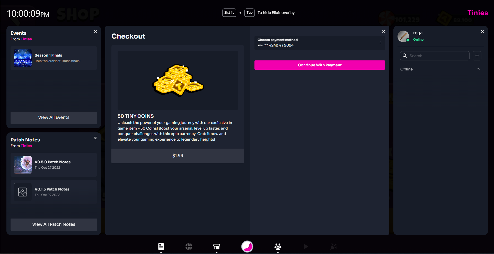

# In-App Purchases

## Overview

Elevate your gaming experience with in-app purchases, ensuring a seamless and secure journey powered by the top-tier commerce and [payment system](payment-gateways.md), [Stripe](https://stripe.com/), and the [Elixir Native Wallet](../elixir-invisible-wallet/). Easily manage your gaming loot and purchases—all part of the ultimate gaming setup.

<figure><figcaption></figcaption></figure>

* ✨ [**Effortless Integration**](developer/) **-** With our user-friendly overlay, integrating in-app purchases has never been smoother. Just a few simple steps, and you're ready to roll!
* ⚙️ [**Developer-Friendly SDK**](../../sdk/unity/) **-** Our SDK is designed with you in mind. Seamlessly blend it into your game, enhancing the user experience without breaking a sweat.
* :money\_mouth: [**Including FIAT & Crypto**](payment-gateways.md) - Our In-App purchases system allows users to pay using FIAT with [Stripe](https://stripe.com/) or Crypto using their [Elixir Native Wallet](../elixir-invisible-wallet/).

<figure><figcaption></figcaption></figure>

Our IAP system introduces an [overlay](broken-reference) seamlessly integrated into the gaming interface, allowing users to make purchases without leaving the gaming environment and optimizing user engagement by simplifying the purchase process.

## Best Practices

Let gamers dive into the gameplay before deciding to make a purchase. Players are more likely to invest in premium in-game items or additional features after they've had a chance to savour the gaming experience and recognize its value.

Keep it simple with clear product names and straightforward descriptions. Easy-to-find titles and plain, direct language make it a breeze for gamers to discover and enhance their gaming arsenal

## Support

#### Technical Assistance

Encounter any challenges or have questions about implementation? Reach out to our technical team for prompt and expert assistance. We're here to help you optimize your in-app purchase system, enabling you to focus on creating captivating gaming experiences.

#### 24-Hour Customer Support

For gamers navigating the purchase process, our 24-hour customer support is ready to assist with any inquiries or concerns. We understand the importance of a seamless user experience, and our support team is dedicated to resolving issues promptly, ensuring gamers have a hassle-free time enjoying their games.

#### Refunds Policy

Concerns about refunds? We've got you covered. Our In-App Purchases service seamlessly integrates with the Stripe system and our Internal refund service for Elixir Native Wallet purchases, allowing for efficient and secure refund processes. This ensures transparency and reliability for both developers and users.

