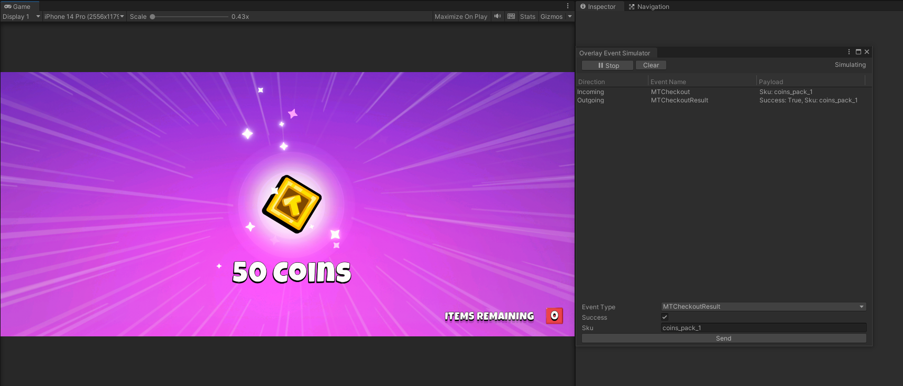

# Client Integration

## Implement SDK


**The integration and utilization of the Elixir SDK Auth constitute mandatory prerequisites for engaging with the In-App Purchases system.** Eligibility for leveraging the In-App Purchases system is contingent upon the association of Elixir accounts with respective internal accounts.


Following the creation of a store for your game and the upload of several products, the next step involves implementing the system within your game.

Initially, it is imperative to ensure the integration of [Elixir SDK](../../../sdk/unity/authentication/). Only games with the Elixir SDK integrated will be granted access to the In-App Purchases system. This mandates the linking of the in-game user account to their Elixir Account.&#x20;

The build uploaded to Elixir needs to disable the option to log out. This measure is crucial to guarantee the security and reliability of the In-App Purchases system.

Once the Elixir SDK, including the account linking, is seamlessly integrated into your game, you are primed to commence the specific [overlay integration following the SDK docs](broken-reference).

## Test your in-app purchases

For testing the In-App Purchases system within your game, our [SDK Events simulator ](broken-reference)facilitates the replication of overlay communication with the game. This approach enables the game to respond appropriately to each event, enhancing the overall user experience.

<figure><figcaption></figcaption></figure>
