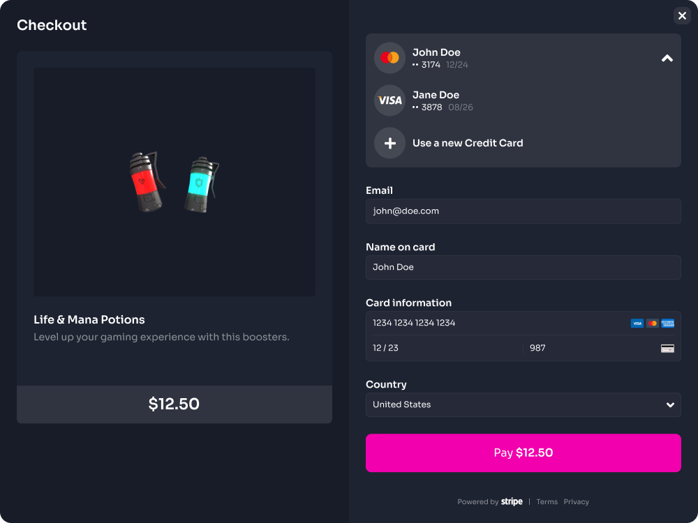

# Payment Gateways

Ensuring a seamless and secure transaction experience, our platform supports FIAT payments through Stripe, leveraging credit cards for traditional transactions. Additionally, for cryptocurrency enthusiasts, our platform integrates our Elixir Native Wallet, offering a cutting-edge solution for crypto-based in-app purchases.

## FIAT Purchases

We've designed a user-friendly UI that ensures a smooth payment experience for gamers. Within the game context and through the Elixir Overlay, users can effortlessly make payments using their saved card details or opt for a new payment method. This integration empowers game developers to monetize their creations while maintaining a cohesive and immersive gaming experience for their users.

<figure><figcaption></figcaption></figure>

## Crypto Purchases

This innovative feature ensures that users remain within the game context throughout the payment process. Through our Elixir Native Wallet system, gamers have the flexibility to pay using the balance available in their wallet.

These wallets are an integral part of our Account Abstraction Protocol, providing users with significant benefits. By using their wallets, users can save on transaction fees and gain access to discounted prices on in-app purchases. This not only enhances the user experience but also incentivizes users to make more in-app purchases.

Furthermore, game owners can sponsor these fees, motivating gamers to engage more actively with in-app purchases. This sponsorship system not only benefits gamers but also creates a win-win scenario for game developers and players, fostering a more vibrant and engaging gaming ecosystem.

<figure><figcaption></figcaption></figure>
