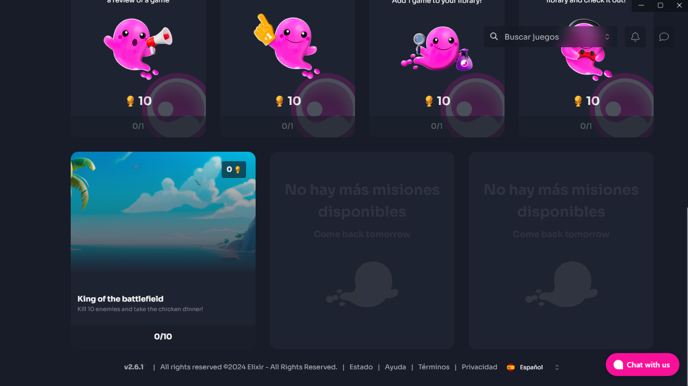

# Test Your Quest

After creating a quest, you can assign it to yourself while it is in DRAFT status. This will assign your user this quest for you to test the server implementation:

1. &#x20;Click on the dropdown menu
2. Click on "Self Assign"\

<figure><figcaption>
 
</figcaption></figure>

Now, you should be able to see that quest in the Elixir Launcher:

1. Open the Elixir Launcher
2. Log in with your Publisher account
3. Go to the Rewards Page > Quests tab
4. Scroll to the Game Quest section, where you will find a carrousel with more than one quest containing your DRAFT quest with 0 trophies.

<figure><figcaption></figcaption></figure>

This quest will give 0 trophies but will allow you to test your server integration, and check that it is progressing normally. Once you have tested it, you can Submit your game for Review.
