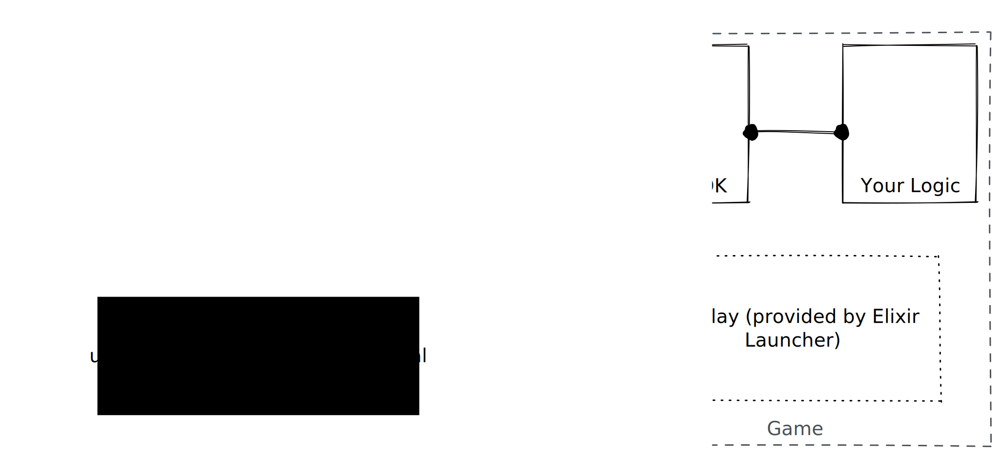
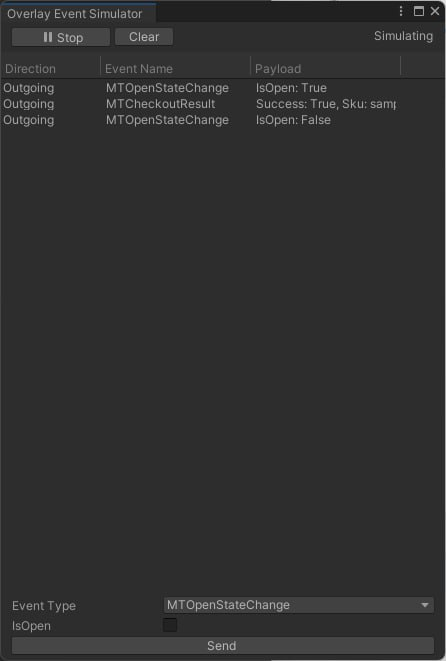
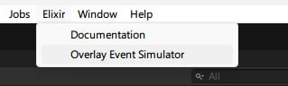
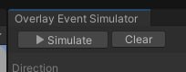
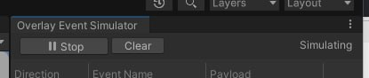

# Elixir Overlay


Elixir Overlay - Getting Started


### Overview



The Elixir Overlay is a feature that allows developers to integrate features like NFT purchasing and friends chat seamlessly into their game.

While the overlay is provided by Elixir Launcher in-game automatically without any additional setup requirements, to integrate all the features of the overlay in-game, some setup is required.

### Initialization & Disposal

Communication with the overlay is provided by the `Elixir.OverlayMessage` namespace. The overlay messaging functionality requires both initialization and teardown, and therefore you must make sure that your script calls `Init()` and then `StopListening()` at the beginning and end of the game process respectively.


**IMPORTANT:** It is crucial to ensure that only one message processing callback is active at a given time. This is why for actual game implementation it is recommended to make the controller interacting with the overlay a singleton.


Here is a minimal example:

<pre class="language-csharp" data-overflow="wrap" data-full-width="false"><code class="lang-csharp"><strong>using Elixir.Overlay;
</strong><strong>
</strong><strong>public class TestOverlayController : MonoBehaviour
</strong>{
	// ... we will assume that a method Log is implemented that prints
	// text on-screen.

	// To initialize, call the Init function, giving it a 
	// callback function that processes incoming messages
	// this should be done as early as possible, only once
	public void Init()
	{
		OverlayMessage.Init(ProcessMessage);
	}
	
	// It is crucial to call the StopListening method in which 
	// we stop listening to incoming messages from the overlay
	// this should be done when we quit the game
	public void OnApplicationQuit()
	{
		OverlayMessage.StopListening();
	}
	
	// The Update() method should be called by the controller to 
	// ensure that events get processed on the main thread
	public void Update()
	{
		OverlayMessage.Update();
	}
	
	// This is our callback that processes incoming messages
	private void ProcessMessage(IMessage message)
	{
		switch (message)
		{
			// the overlay has opened or closed
			case MOpenStateChange openStateChange:
				Log($"MOpenStateChange: {openStateChange.IsOpen}");
				break;
			// checkout was completed
			case MCheckoutResult checkoutResult:
				Log($"MCheckoutResult: {checkoutResult.Success}");
				break;
		}
	}
}
</code></pre>

### Overlay Actions

Once initialized, the following functionality is available:

#### Checkout

You can trigger checkout of an NFT payable with credit card or a crypto wallet by calling `OverlayMessage.Checkout`:&#x20;

```csharp
OverlayMessage.Checkout("MY_ITEM_SKU")
```

Once initialized, the result of the checkout will be returned as an incoming message of type `OverlayMessage.MCheckoutResult`.


Only one checkout process can be started at a given time. Calling `Checkout` a second time before getting the result will interrupt a previous checkout process.


### Event Simulator

In production environments, the overlay is injected into the game by the Elixir Launcher. However, this is difficult to replicate during development. This is why we have created the Event Simulator.

<figure><figcaption><p>You can simulate connectivity with the Overlay in the Unity Editor</p></figcaption></figure>

The simulator allows you to test your game's integration with the Elixir Overlay event buffer without leaving Unity Editor.

You can access it in the editor's toolbar by clicking on `Elixir -> Overlay Event Simulator`

<figure><figcaption></figcaption></figure>

The simulator will open and be in the "Stopped" state. If you wish to test your integration, run the game and click on `Simulate`.

<figure><figcaption></figcaption></figure>

If everything goes well, the status of the simulator will now change from "Stopped" to "Simulating".

<figure><figcaption></figcaption></figure>

You will now be able to use the event simulator to see incoming [events](sdk-events.md) and send events to the game impersonating the overlay.
