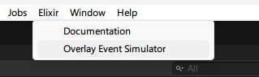
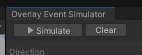

# Event Simulator

In production environments, the overlay is injected into the game by the Elixir Launcher. However, this is difficult to replicate during development. This is why we have created the Event Simulator.

<figure><figcaption>
You can simulate connectivity with the Overlay in the Unity Editor
</figcaption></figure>

The simulator allows you to test your game's integration with the Elixir Overlay event buffer without leaving Unity Editor.

You can access it in the editor's toolbar by clicking on `Elixir -> Overlay Event Simulator`

<figure><figcaption></figcaption></figure>

The simulator will open and be in the "Stopped" state. If you wish to test your integration, run the game and click on `Simulate`.

<figure><figcaption></figcaption></figure>

If everything goes well, the status of the simulator will now change from "Stopped" to "Simulating".

<figure><figcaption></figcaption></figure>

You will now be able to use the event simulator to see incoming [events](sdk-events.md) and send events to the game impersonating the overlay.
